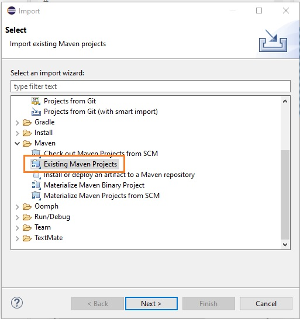
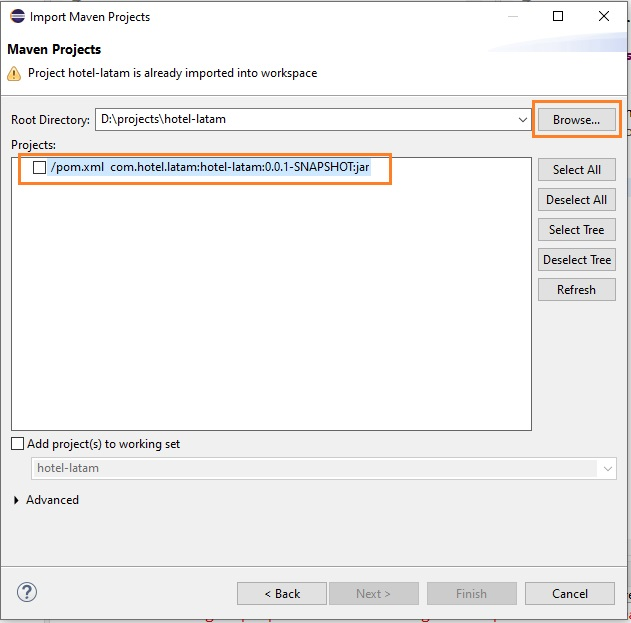

# Challenge ONE | Java | Back-end | Hotel Alura

     

---
## 🖥️ Tecnologías Utilizadas:

- Java
- Eclipse
- Biblioteca JCalendar
- MySql
- Plugin WindowBuilder  

---
## ⚠️ Importante! ⚠️

☕ Use Java versión 8 o superior para compatibilidad.   
📝 Recomendamos usar el editor de Eclipse para compatibilidad con la Interfaz Gráfica.   
---

## 📝 Eclipse

### ¿Cómo importar mi proyecto a Eclipse?

1 - Una vez dentro del Editor al lado izquierdo, haz clic en el <em>Files</em> que está en el menú en la parte superior, elige la opción <em>Existing Maven PRojects</em>.

     

Luego haz click en <em>Directory</em> y ubica el directorio del proyecto "clonado" o "extraído" en tu computadora y has check en el arcivo pom. Haz click en <em>Finish</em> para completar la importación.

     

## 📅 JCalendar

Tras realizar la importación a tu editor, es necesario instalar la librería <strong>JCalendar</strong>, de lo contrário, el proyecto presentará un error y no será posible abrir la ventana de <strong>Reservas</strong>.  

Para instalar, se necesita descargar el paquete a través de ese enlace: 
🔹 [Link para el JCalendar](https://toedter.com/jcalendar/)

     

El siguiente paso es extraer los archivos a una carpeta e importar los archivos desde la carpeta <strong>lib</strong> a una carpeta local e importar los archivos a Eclipse.

          

Archivos de carpeta <strong>lib</strong>:

     

Haz click con el botón derecho encima del proyecto ubicado en el <strong>Package Explorer</strong>, elijas la opción <em>Build Path</em> y <em>Configure Build Path</em>.

     

El proyecto tendrá un mensaje de error que indica que la ruta de la biblioteca no existe en tu computadora. Haz click en <em>Libraries</em>, luego en <em>Classpath</em> seleccione el archivo JCalendar, elije la opción <em>Remove</em> y <em>Apply and Close</em>.

     

Para importar el <strong>Jcalendar</strong> desde tu computadora, después de haber "extraído" los archivos de la descarga, pulsa en <em>ClassPath</em> y luego en <em>Add External JARS</em> agrega uno por uno  o selecciona todos de una vez y haz click en <em>Apply and Close</em>.

     

Por lo tanto, el proyecto debe contener los siguientes archivos después de las importaciones:

     

## 🚧 Proyecto

#### Al clonar o descargar el proyecto base y tener instalado el JCalendar, tendrás esta presentación al ejecutar el proyecto en Eclipse:

     

### Video de demostración

🧡 <strong>Oracle</strong> 

💙 <strong>Alura Latam</strong> 

